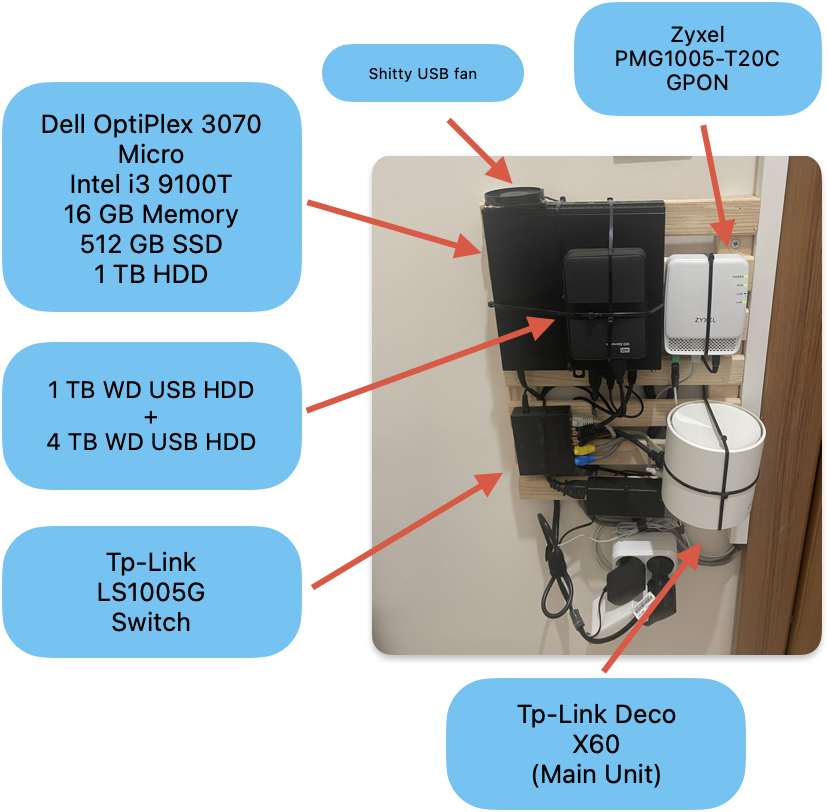
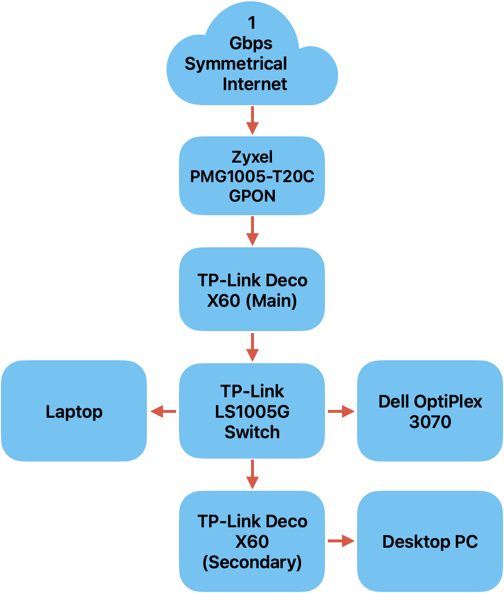

_I originally wrote this blog post in 2023. Since then, my setup has changed quite a bit so here’s the updated version for September 2025!_

I run a simple home lab that covers everything I need.

The setup is a single Proxmox server hosting around 20 LXCs. Among them are a development container, the _arr_ stack, AdGuard, Syncthing, Gitea, Proxmox Backup Server, and a few others. The server has three HDDs, totaling 6 TB of storage. Using [mergerfs](https://github.com/trapexit/mergerfs), I combine them into one directory, so I don’t have to juggle mounts or manually move files around to manage space.

Backups are handled weekly through Proxmox Backup Server, and an Rclone LXC pushes those backup files to Google Drive. I don’t bother backing up anything that can easily be pulled from the internet again so only the LXCs are included in the backup job. Nothing on the server is exposed publicly to the internet, since I never need remote access to anything I have on my network when I’m away from home.

For DNS, my Deco mesh points to AdGuard, giving me network-wide blocking across all devices.

Everything is mounted neatly, zip-tied to a small wooden pallet screwed to the wall, and all cables, including the ethernet cable running to the secondary Deco unit, are routed cleanly through cable channels.

Network:

