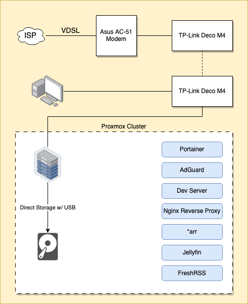

Inspired by [this post](https://www.reddit.com/r/homelab/comments/14wcyh9/finally_made_a_drawing_of_my_crazy_homelab_house/), I decided to draw a diagram of my very simple home server/network setup with the goal of documenting how it evolves over time (it will, I have the itch).

- The modem is in a very awkward position and I can neither move it nor lay ethernet, so I can only rely on wireless mesh.

### Resources
- [Draw.io file](./homelab.drawio)