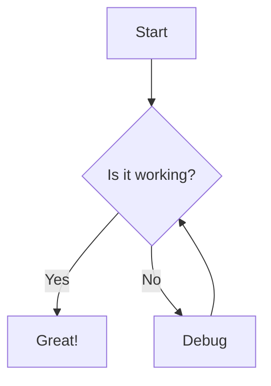
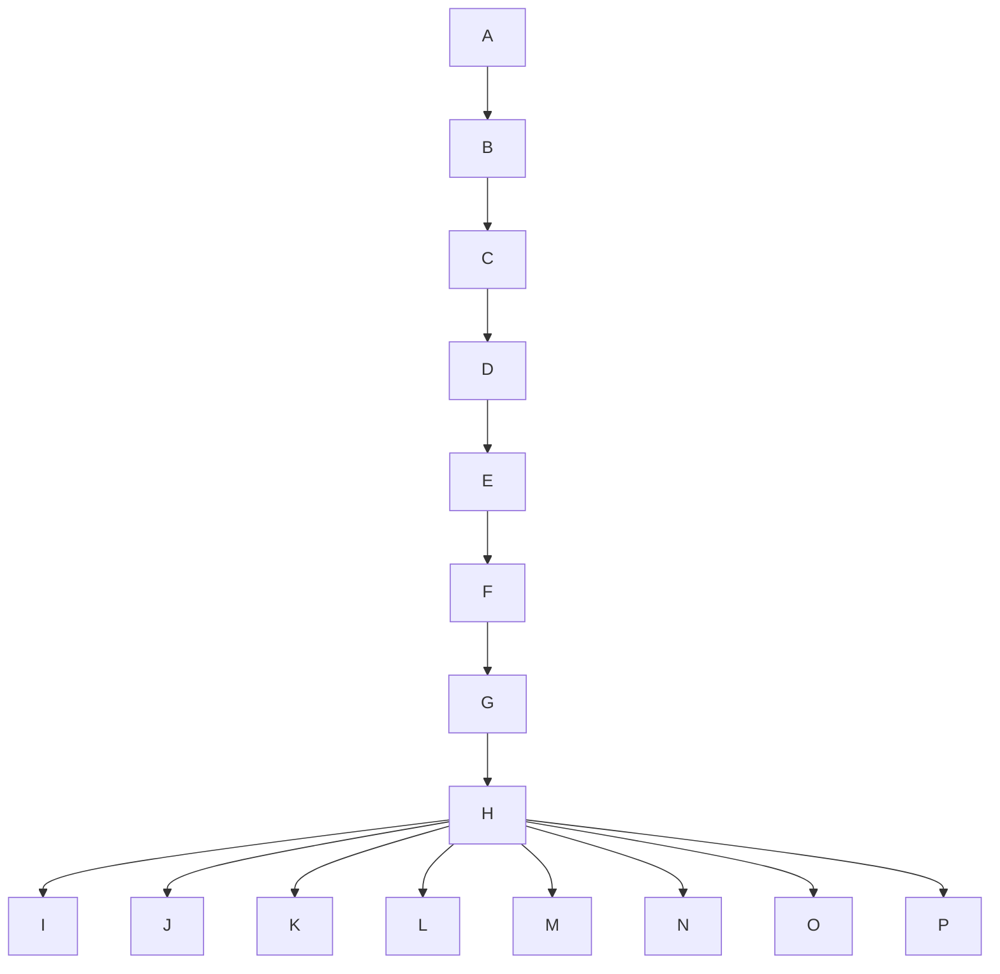
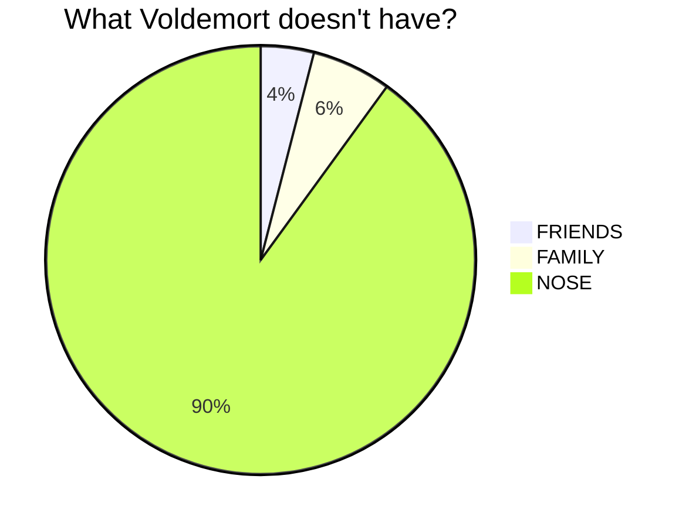
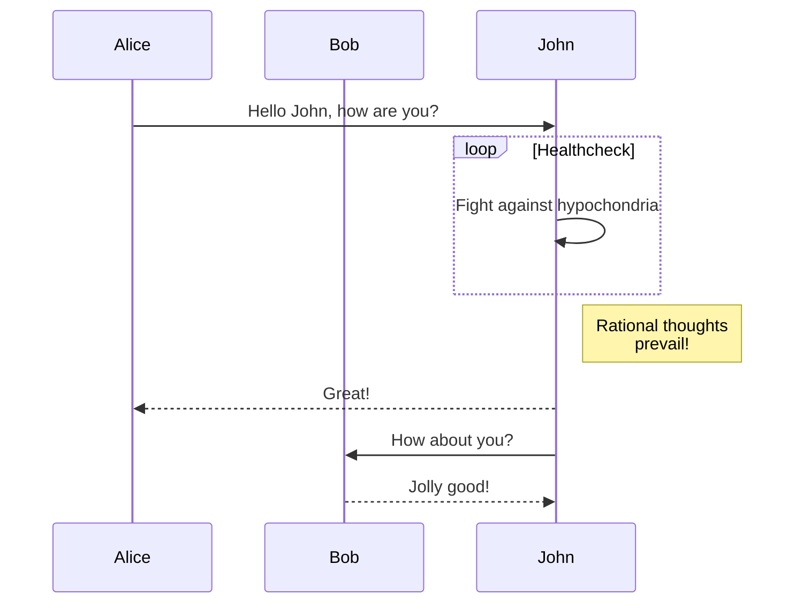
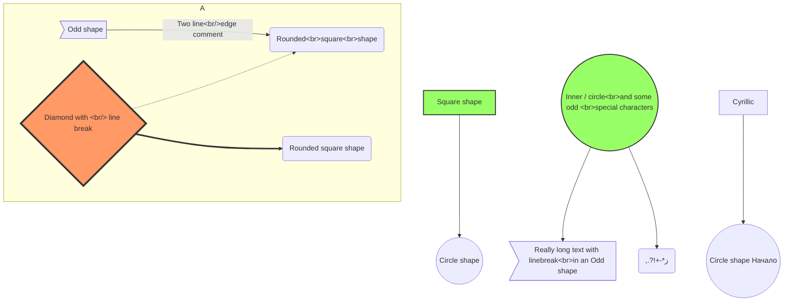

<svg version="1.1" xmlns="http://www.w3.org/2000/svg" viewBox="0 0 306.7709313298576 330.58621763694094" width="613.5418626597152" height="661.1724352738819">
  <g stroke-linecap="round"><g transform="translate(11.15000993385911 319.45055311030706) rotate(0 142.25 0)"><path d="M-1.15 -0.13 C46.14 0.07, 237.01 1.15, 284.57 1.14 M0.45 -1.24 C47.51 -1.35, 236.52 -0.76, 283.66 -0.39" stroke="#1e1e1e" stroke-width="2" fill="none"></path></g></g><mask></mask><g stroke-linecap="round"><g transform="translate(294.1500099338591 318.95055311030706) rotate(0 0 -154.25)"><path d="M1.01 1.2 C1.21 -49.93, 0.67 -255.7, 0.48 -307.4 M0.08 0.78 C0.23 -50.6, -0.05 -257.48, -0.22 -308.95" stroke="#1e1e1e" stroke-width="2" fill="none"></path></g></g><mask></mask><g stroke-linecap="round"><g transform="translate(296.6500099338591 55.450553110307055) rotate(0 -14.75 0)"><path d="M0.12 0.4 C-4.87 0.48, -25.07 0.24, -29.99 0.24 M-0.48 0.12 C-5.3 0.06, -24.14 -0.51, -29.01 -0.6" stroke="#1e1e1e" stroke-width="2" fill="none"></path></g></g><mask></mask><g stroke-linecap="round" transform="translate(160.1500099338591 30.450553110307055) rotate(0 52.25 26.25)"><path d="M13.13 0 C32.58 0.68, 56.45 0.45, 91.38 0 M13.13 0 C39.17 0.73, 66.02 1.19, 91.38 0 M91.38 0 C101.35 0.47, 105.92 5.98, 104.5 13.13 M91.38 0 C98.55 2.23, 106.67 2.67, 104.5 13.13 M104.5 13.13 C105 19.69, 106.54 29.82, 104.5 39.38 M104.5 13.13 C104.72 17.76, 103.68 22.81, 104.5 39.38 M104.5 39.38 C103 48.37, 98.54 54.36, 91.38 52.5 M104.5 39.38 C106.58 49.06, 99.06 53.79, 91.38 52.5 M91.38 52.5 C67.14 53.58, 39.86 54.53, 13.13 52.5 M91.38 52.5 C75.01 52.89, 55.92 51.86, 13.13 52.5 M13.13 52.5 C5.34 50.88, 0.57 46.58, 0 39.38 M13.13 52.5 C6.38 52.31, 0.42 47.39, 0 39.38 M0 39.38 C0.21 30.3, 1.5 20.54, 0 13.13 M0 39.38 C0.7 33.9, 0.68 26.76, 0 13.13 M0 13.13 C0.11 6.34, 2.46 1.58, 13.13 0 M0 13.13 C0.82 5.43, 6.08 -0.58, 13.13 0" stroke="#1e1e1e" stroke-width="2" fill="none"></path></g><g stroke-linecap="round" transform="translate(199.1500099338591 82.45055311030706) rotate(0 15.25 27.75)"><path d="M7.63 0 C9.33 0.75, 13.75 0.17, 22.88 0 M7.63 0 C12.88 -0.39, 19.52 0.62, 22.88 0 M22.88 0 C26.01 -0.6, 31.9 1.05, 30.5 7.63 M22.88 0 C28.86 -0.9, 32.72 2.29, 30.5 7.63 M30.5 7.63 C32.71 19.86, 29.74 31.7, 30.5 47.88 M30.5 7.63 C30.52 20.39, 31.41 34.19, 30.5 47.88 M30.5 47.88 C29.57 53.35, 28.01 56.53, 22.88 55.5 M30.5 47.88 C29.08 51.62, 26.86 53.48, 22.88 55.5 M22.88 55.5 C19.27 55.09, 14.42 56.6, 7.63 55.5 M22.88 55.5 C18.03 55.11, 12.23 56, 7.63 55.5 M7.63 55.5 C2.1 56.12, -1.11 51.88, 0 47.88 M7.63 55.5 C4.29 54.92, 1.73 51.65, 0 47.88 M0 47.88 C0.74 36.69, -0.48 24.38, 0 7.63 M0 47.88 C1.23 37.69, 0.59 25.37, 0 7.63 M0 7.63 C0.92 3.44, 3.31 1.32, 7.63 0 M0 7.63 C-1.46 1.77, 1.64 1.6, 7.63 0" stroke="#1e1e1e" stroke-width="2" fill="none"></path></g><g stroke-linecap="round" transform="translate(160.1500099338591 287.95055311030706) rotate(0 54.25 15.25)"><path d="M7.63 0 C43.54 -0.6, 75.94 0.59, 100.88 0 M7.63 0 C27.86 -1.2, 50.01 -0.65, 100.88 0 M100.88 0 C106.1 0.19, 108.78 1.86, 108.5 7.63 M100.88 0 C104.28 2.28, 109.07 1.5, 108.5 7.63 M108.5 7.63 C107.18 12.88, 107.95 17.89, 108.5 22.88 M108.5 7.63 C108.41 11.15, 108.03 15.83, 108.5 22.88 M108.5 22.88 C110 28.43, 105.74 31.83, 100.88 30.5 M108.5 22.88 C110.42 26.99, 106.91 29.89, 100.88 30.5 M100.88 30.5 C68.49 28.51, 34.45 29.32, 7.63 30.5 M100.88 30.5 C64.3 30.74, 26.14 29.97, 7.63 30.5 M7.63 30.5 C3.42 31.72, 1.91 29.08, 0 22.88 M7.63 30.5 C0.5 31.38, 1.65 28.47, 0 22.88 M0 22.88 C-1.15 19.95, -1.22 15.59, 0 7.63 M0 22.88 C0.9 18.33, -0.52 14.34, 0 7.63 M0 7.63 C-1.24 3.26, 0.89 -1.11, 7.63 0 M0 7.63 C-0.31 0.66, 0.61 -1.99, 7.63 0" stroke="#1e1e1e" stroke-width="2" fill="none"></path></g><g stroke-linecap="round"><g transform="translate(193.6500099338591 56.450553110307055) rotate(0 21.25 0)"><path d="M-0.4 0.35 C6.59 0.4, 34.94 0.33, 42.07 0.18 M0.39 0.06 C7.54 -0.06, 36.15 -0.65, 43.09 -0.69" stroke="#1e1e1e" stroke-width="2" fill="none"></path></g></g><mask></mask><g stroke-linecap="round"><g transform="translate(198.1171185327587 140.8348463630159) rotate(0 -18.19214662635443 70.27450188728852)"><path d="M-0.8 0.61 C-6.56 24.07, -29.63 116.4, -35.6 139.77" stroke="#1e1e1e" stroke-width="2.5" fill="none" stroke-dasharray="1.5 8"></path></g></g><mask></mask><g stroke-linecap="round"><g transform="translate(229.80666426898892 140.2480029234561) rotate(0 18.4855683461343 71.74161048618802)"><path d="M1.04 -0.34 C7.05 23.43, 31.21 118.81, 37.01 142.61" stroke="#1e1e1e" stroke-width="2.5" fill="none" stroke-dasharray="1.5 8"></path></g></g><mask></mask>
</svg>


# h1 Heading 8-)
## h2 Heading
### h3 Heading
#### h4 Heading
##### h5 Heading
###### h6 Heading


## Horizontal Rules

___

---

***


## Typographic replacements

Enable typographer option to see result.

(c) (C) (r) (R) (tm) (TM) (p) (P) +-

test.. test... test..... test?..... test!....

!!!!!! ???? ,,  -- ---

"Smartypants, double quotes" and 'single quotes'


## Emphasis

**This is bold text**

__This is bold text__

*This is italic text*

_This is italic text_

~~Strikethrough~~


## Blockquotes


> Blockquotes can also be nested...
>> ...by using additional greater-than signs right next to each other...
> > > ...or with spaces between arrows.


## Lists

Unordered

+ Create a list by starting a line with `+`, `-`, or `*`
+ Sub-lists are made by indenting 2 spaces:
  - Marker character change forces new list start:
    * Ac tristique libero volutpat at
    + Facilisis in pretium nisl aliquet
    - Nulla volutpat aliquam velit
+ Very easy!

Ordered

1. Lorem ipsum dolor sit amet
2. Consectetur adipiscing elit
3. Integer molestie lorem at massa


1. You can use sequential numbers...
1. ...or keep all the numbers as `1.`

Start numbering with offset:

57. foo
1. bar


## Code

Inline `code`

Indented code

    // Some comments
    line 1 of code
    line 2 of code
    line 3 of code


Block code "fences"

```
Sample text here...
```

Syntax highlighting

``` js
var foo = function (bar) {
  return bar++;
};

console.log(foo(5));
```

## Tables

| Option | Description                                                               |
| ------ | ------------------------------------------------------------------------- |
| data   | path to data files to supply the data that will be passed into templates. |
| engine | engine to be used for processing templates. Handlebars is the default.    |
| ext    | extension to be used for dest files.                                      |

Right aligned columns

| Option |                                                               Description |
| -----: | ------------------------------------------------------------------------: |
|   data | path to data files to supply the data that will be passed into templates. |
| engine |    engine to be used for processing templates. Handlebars is the default. |
|    ext |                                      extension to be used for dest files. |


## Links

[link text](http://dev.nodeca.com)

[link with title](http://nodeca.github.io/pica/demo/ "title text!")

Autoconverted link https://github.com/nodeca/pica (enable linkify to see)


## Images


Like links, Images also have a footnote style syntax

![Alt text][id]

With a reference later in the document defining the URL location:

[id]: https://octodex.github.com/images/dojocat.jpg  "The Dojocat"


## Plugins

The killer feature of `markdown-it` is very effective support of
[syntax plugins](https://www.npmjs.org/browse/keyword/markdown-it-plugin).


### [Emojies](https://github.com/markdown-it/markdown-it-emoji)

> Classic markup: :wink: :crush: :cry: :tear: :laughing: :yum:
>
> Shortcuts (emoticons): :-) :-( 8-) ;)

see [how to change output](https://github.com/markdown-it/markdown-it-emoji#change-output) with twemoji.


### [Subscript](https://github.com/markdown-it/markdown-it-sub) / [Superscript](https://github.com/markdown-it/markdown-it-sup)

- 19^th^
- H~2~O


### [\<ins>](https://github.com/markdown-it/markdown-it-ins)

++Inserted text++


### [\<mark>](https://github.com/markdown-it/markdown-it-mark)

==Marked text==


### [Footnotes](https://github.com/markdown-it/markdown-it-footnote)

Footnote 1 link[^first].

Footnote 2 link[^second].

Inline footnote^[Text of inline footnote] definition.

Duplicated footnote reference[^second].

[^first]: Footnote **can have markup**

    and multiple paragraphs.

[^second]: Footnote text.


### [Definition lists](https://github.com/markdown-it/markdown-it-deflist)

Term 1

:   Definition 1
with lazy continuation.

Term 2 with *inline markup*

:   Definition 2

        { some code, part of Definition 2 }

    Third paragraph of definition 2.

_Compact style:_

Term 1
  ~ Definition 1

Term 2
  ~ Definition 2a
  ~ Definition 2b


### [Abbreviations](https://github.com/markdown-it/markdown-it-abbr)

This is HTML abbreviation example.

It converts "HTML", but keep intact partial entries like "xxxHTMLyyy" and so on.

*[HTML]: Hyper Text Markup Language

### [Custom containers](https://github.com/markdown-it/markdown-it-container)

::: warning
*here be dragons*
:::

## Mermaid











