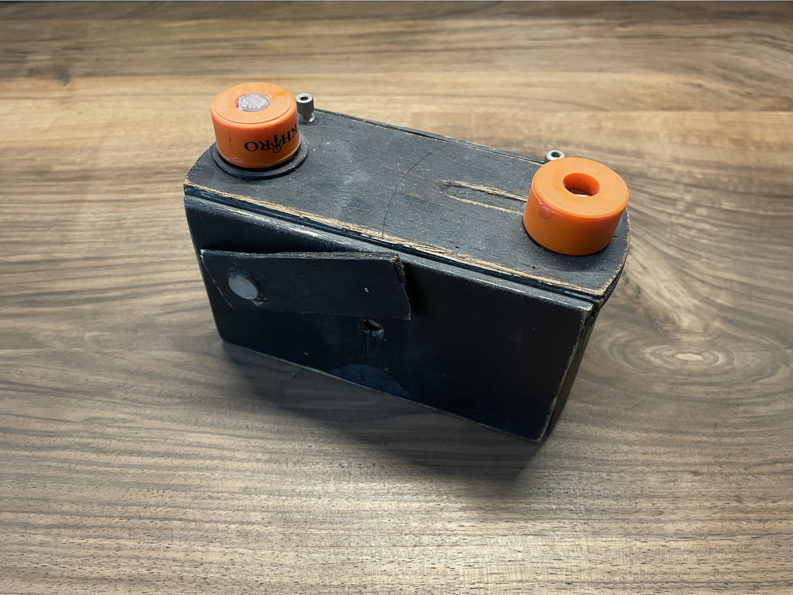
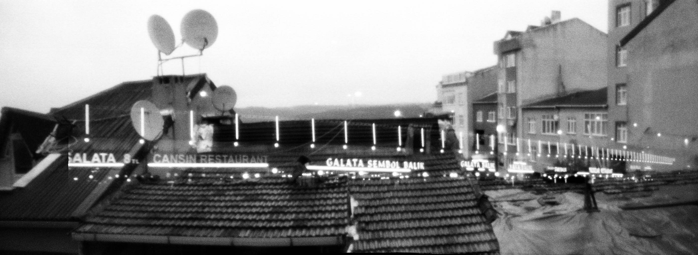
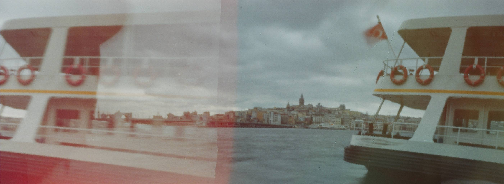
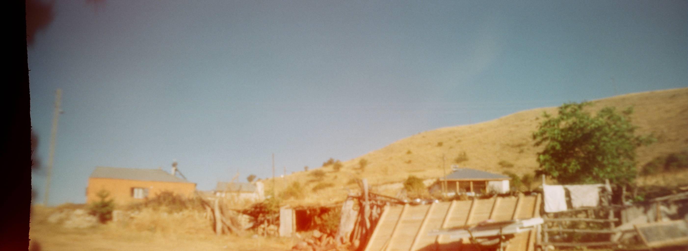
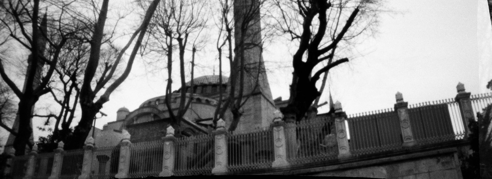
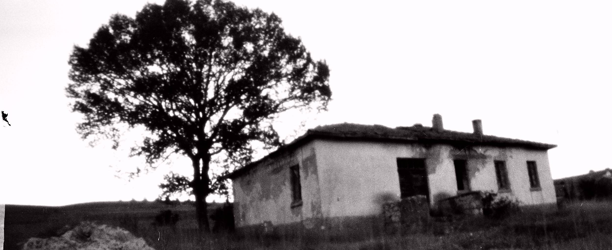
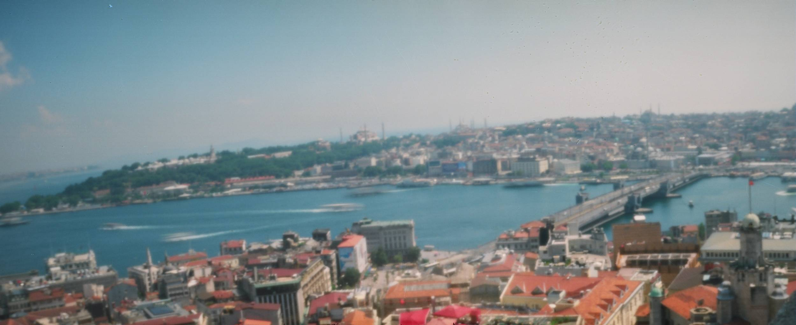

###### This is a write-in-progress post that I will be updating over time.

I was into designing and building my own cameras roughly ten years ago, and I have been meaning to get back into it for quite some time now. I recently came across some of the old photographs I took with these cameras and it rekindled the passion I had for the craft.

I decided to build several different cameras again, fixing the issues that previous builds had, and document the whole process in a series of blog posts.

If everything goes according to plan, I will build:
- A 35mm panoramic with curved film plane
- A compact, half frame 35mm with short focal length
- A 6x6

I want all of these to sport a 1/4" tripod mount, replaceable pinhole plates, magnetic filter mounts, a lockable shutter that can be operated manually or with a cable release, a screw-lock body, leak-safe and precision film advance knobs, film counter (for medium-format), magnetic accessory mounts (spirit levels, viewfinders etc.), and hassle-free film spools (especially for the 35mm).

## The Old Panoramic Pinhole

This was my favorite camera to shoot with for a long time. I made it from whatever material I had at home at the time: wood from an old cigar box, metal sheet from a soda can, knobs from skateboard bushings, one spool-catch (or whatever they are called) from an old FM radio antenna and the other one from a scrapped Zorki 4K, packaging paper, electrical tape, and other random stuff that I found around.

I had even drawn a now-lost schematic diagrams before building it to make sure I was doing everything right.

As you can tell, it is a product-of-love but it had its problems.

Namely, unintentional multiple exposures:

Poor film alignment:

Occasional light leaks:

and others that I cannot remember for now. So, it wasn't the most reliable thing ever. But, when it worked, it worked beautifully.

## Redesign

I will start with the design process. BRB
