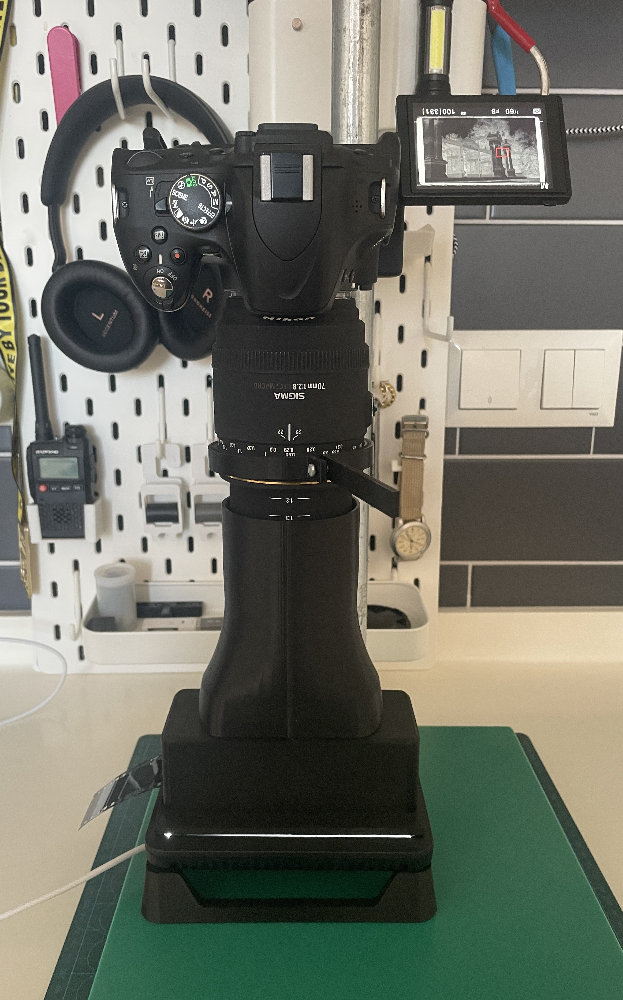
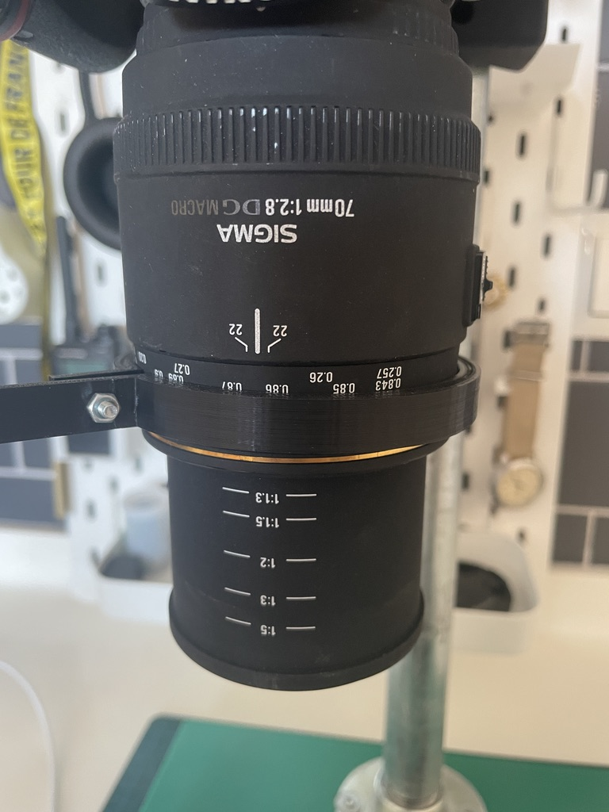
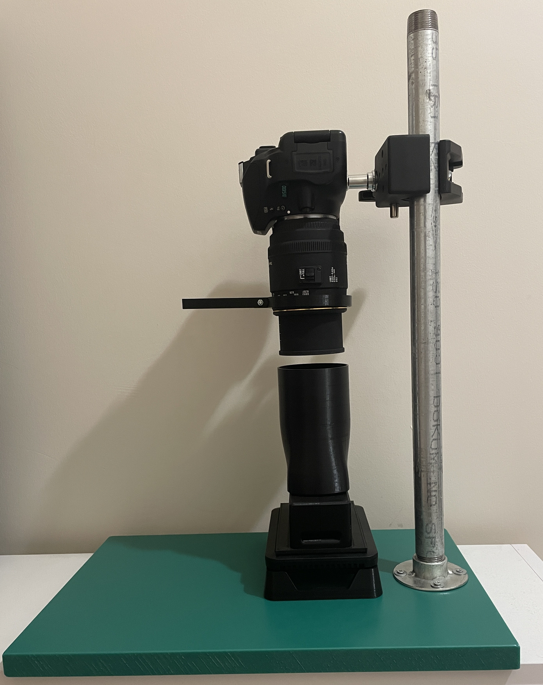
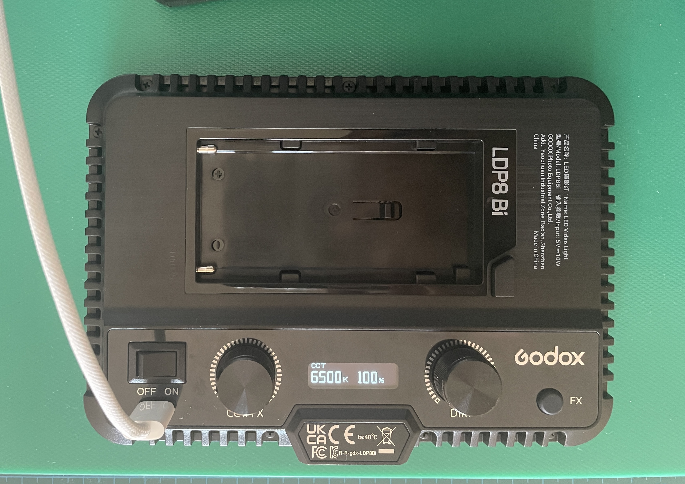
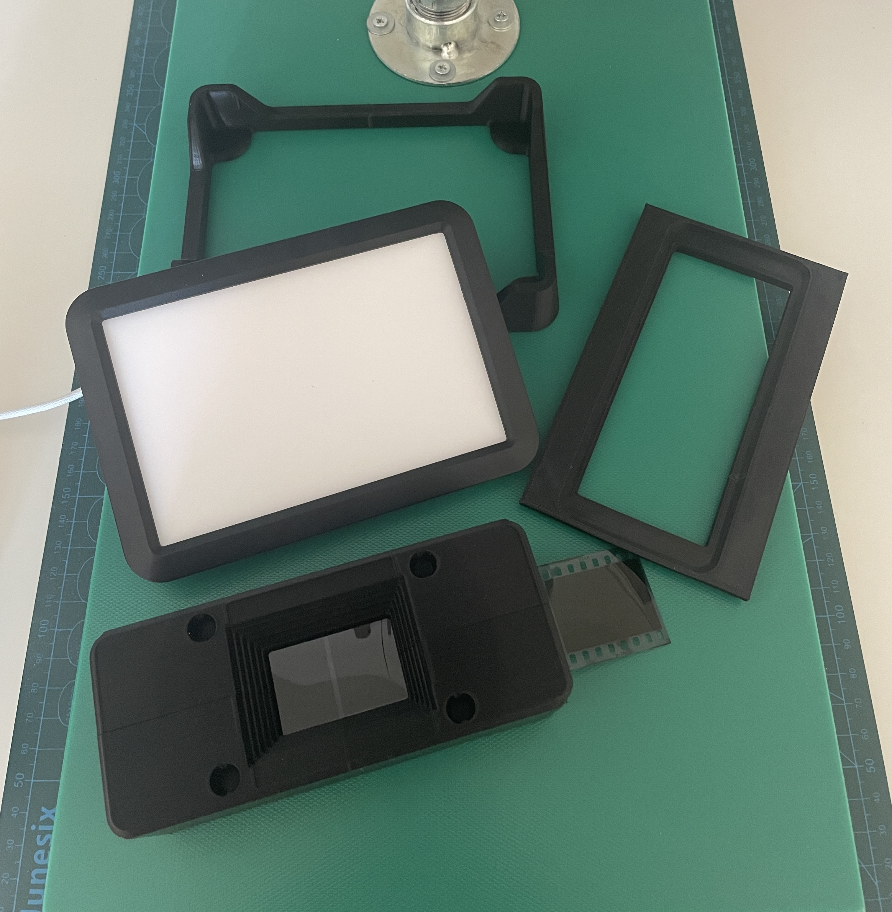
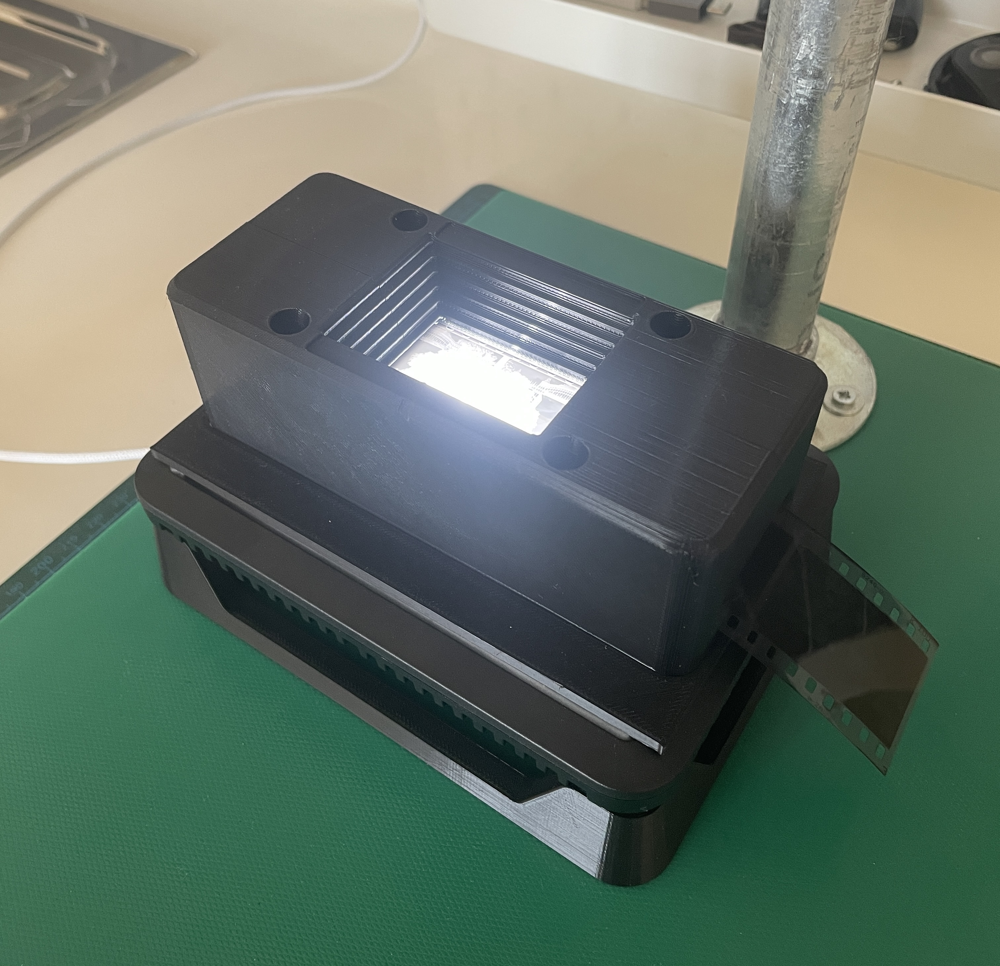
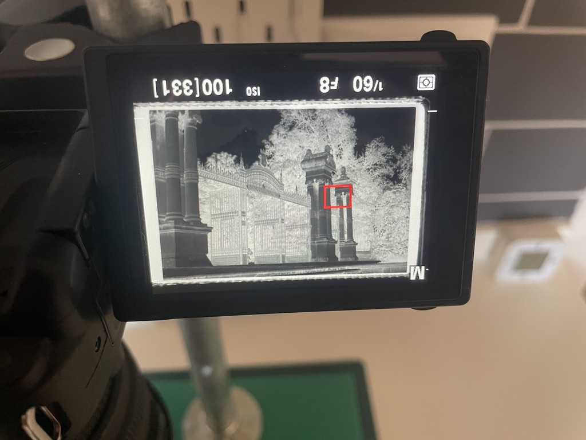

#### *Part List*

- Nikon D5100
- Sigma 70mm f/2.8 EX DG 
- Godox LDP8Bi LED Video Light
- [3D Printed 35mm film holder](https://www.thingiverse.com/thing:4620992)
- [3D Printed mask/stand for film holder](https://www.printables.com/model/1357811-godox-ldp8bi-negative-holder)
- [3D Printed base stand for backlight](https://www.printables.com/model/1355994-godox-ldp8bi-flat-base-stand)
- [3D Printed focus ring extension](https://www.printables.com/model/1360363-74mm-lens-focus-ring-extension)
- [3D Printed lens hood](https://www.printables.com/model/1419290-35mm-hood-for-negative-holder-with-74mm-diameter)

---

I put together this simple DSLR film scanning rig to re-digitize my negatives (some of the shop scans I had were horrid) and to scan my home-developed films. I chose this route because:

- I already had a DSLR lying around
- Decent scanners are expensive or hard to come by where I live
- Second-hand scanners aren’t guaranteed to last

That said, this wasn’t a straightforward path. It required research, careful planning, and some DIY work. In this blog post, I’ll walk through how I did the thing that's been done many times by other people.

## Requirements

The final setup had to meet a few needs:

1. **Needed** to fit 35mm films in the frame nicely. Support for 120mm would have been a huge plus.
2. **Needed** to be easy to assemble, with few moving parts, and sturdy.
3. **Needed** to be much cheaper than dedicated film scanners for all this effort to make sense.
4. **Did not need** motorization or automation. Speed is not a priority since finishing a roll takes weeks or months for me.

## The Camera

Everything had to be built around the camera I own: a **Nikon D5100**. Its 16MP APS-C sensor (not full-frame) is good enough for my needs since I don’t plan on making large prints. The swiveling screen it has is especially useful for making adjustments without bending over the screen.

The rest of the specs are irrelevant here because they are either common in most modern digital cameras, or they don’t matter for scanning.

The biggest limitation worth mentioning is that the APS-C sensor is smaller than full-frame, which introduces some challenges, which is covered in the lens section.

## The Lens

I picked up a second-hand **Sigma 70mm f/2.8 EX DG** (the older non-“Art” version) from a local photography store for around ~150 Euros.

The APS-C crop factor is 1.5x, so this lens behaves like a 105mm on a full-frame (`70mm × 1.5`). It also supports true 1:1 magnification, meaning a `5cm × 5cm` subject projects onto the sensor exactly as `5cm × 5cm`.

A 35mm (`24mm x 36mm`) film frame would create a reflection of the same size on the sensor plane (on the other side of the lens, where the image is focuses) at 1:1 magnification point. Since full-frame digital cameras have the exact same size with 35mm film for their sensors, 1:1 magnification creates an ideal scenario where you can project the film frame perfectly onto the sensor and capture all its details without zooming out. But with an APS-C sensor, the smaller size means that it only covers part of that projected image (roughly 1.5× cropped). To fit the whole frame, we need to move the camera further away from the negative, which sacrifices some detail/density.

<svg version="1.1" xmlns="http://www.w3.org/2000/svg" viewBox="0 0 480.01484754248924 344.82553148382067" width="960.0296950849785" height="689.6510629676413">
<!-- svg-source:excalidraw --><metadata></metadata><defs></defs><g transform="translate(10 10) rotate(0 52.78333282470703 20)"><text x="0" y="14.096" font-family="Excalifont, Xiaolai, sans-serif, Segoe UI Emoji" font-size="16px" fill="#1971c2" text-anchor="start" style="white-space: pre;" direction="ltr" dominant-baseline="alphabetic">APS-C sensor</text><text x="0" y="34.096000000000004" font-family="Excalifont, Xiaolai, sans-serif, Segoe UI Emoji" font-size="16px" fill="#1971c2" text-anchor="start" style="white-space: pre;" direction="ltr" dominant-baseline="alphabetic">(1.5x smaller)</text></g><g stroke-linecap="round" transform="translate(395.4915811107923 85.03579780375179) rotate(0 27.063491376593504 56.932061793258555)"><path d="M13.53 0 C22.79 -0.54, 32.34 1.72, 40.6 0 M13.53 0 C22.64 -1.13, 32.67 0.04, 40.6 0 M40.6 0 C49.84 -1.49, 54.16 3.1, 54.13 13.53 M40.6 0 C51.22 -1.57, 55.14 6.53, 54.13 13.53 M54.13 13.53 C54.38 31.58, 54.29 48.06, 54.13 100.33 M54.13 13.53 C55.25 38.3, 55.89 63.34, 54.13 100.33 M54.13 100.33 C54 109.86, 48.58 112.58, 40.6 113.86 M54.13 100.33 C55.61 107.64, 48.44 115.73, 40.6 113.86 M40.6 113.86 C30.92 112.92, 18.54 114.34, 13.53 113.86 M40.6 113.86 C30.29 114.71, 20.39 114.23, 13.53 113.86 M13.53 113.86 C4.06 114.57, 0.53 110.46, 0 100.33 M13.53 113.86 C6.57 113.19, -0.14 110.67, 0 100.33 M0 100.33 C1.12 76.89, -1.3 52.53, 0 13.53 M0 100.33 C-0.7 66.5, 0.63 32.69, 0 13.53 M0 13.53 C0.58 3.25, 3.53 1.13, 13.53 0 M0 13.53 C-0.27 5.48, 5.25 0.34, 13.53 0" stroke="#1e1e1e" stroke-width="1" fill="none"></path></g><g stroke-linecap="round" transform="translate(327.61316654873184 118.60022229380712) rotate(0 34.01137659136788 24.004936502381383)"><path d="M12 0 C26.93 1.85, 39.65 -1.86, 56.02 0 M12 0 C29.73 0.68, 46.91 -0.36, 56.02 0 M56.02 0 C64.05 -1.41, 69.42 2.64, 68.02 12 M56.02 0 C65.03 2.02, 65.93 2.25, 68.02 12 M68.02 12 C68.96 17.45, 67.94 28.37, 68.02 36.01 M68.02 12 C69 17.87, 68.03 25.18, 68.02 36.01 M68.02 36.01 C66.98 42.73, 65.31 46.52, 56.02 48.01 M68.02 36.01 C66.85 45.87, 66.2 48.73, 56.02 48.01 M56.02 48.01 C38.78 48.02, 24.19 49.16, 12 48.01 M56.02 48.01 C42.45 48.77, 29.82 48.74, 12 48.01 M12 48.01 C4.53 49.12, 1.79 43.42, 0 36.01 M12 48.01 C3.86 49.32, -0.36 46.31, 0 36.01 M0 36.01 C-0.67 32.33, 1.48 26.04, 0 12 M0 36.01 C0.98 30.39, 0.4 25.44, 0 12 M0 12 C-0.98 5.13, 3.77 0.84, 12 0 M0 12 C0.74 4.34, 2.24 -0.62, 12 0" stroke="#1e1e1e" stroke-width="1" fill="none"></path></g><g stroke-linecap="round"><g transform="translate(442.88461993762206 100.74078123528585) rotate(0 0 40.94397341809898)"><path d="M0 0 C0 13.65, 0 68.24, 0 81.89 M0 0 C0 13.65, 0 68.24, 0 81.89" stroke="#e03131" stroke-width="4" fill="none"></path></g></g><mask></mask><g transform="translate(337.5815131919033 19.99239354171999) rotate(0 66.21666717529297 10)"><text x="0" y="14.096" font-family="Excalifont, Xiaolai, sans-serif, Segoe UI Emoji" font-size="16px" fill="#e03131" text-anchor="start" style="white-space: pre;" direction="ltr" dominant-baseline="alphabetic">Full-frame sensor</text></g><g stroke-linecap="round"><g transform="translate(443.75851182839546 89.05245998627686) rotate(0 2.617729061265379 -21.454127714705322)"><path d="M0 0 C0.87 -7.15, 4.36 -35.76, 5.24 -42.91 M0 0 C0.87 -7.15, 4.36 -35.76, 5.24 -42.91" stroke="#e03131" stroke-width="2" fill="none"></path></g><g transform="translate(443.75851182839546 89.05245998627686) rotate(0 2.617729061265379 -21.454127714705322)"><path d="M10.11 -21.85 C8.49 -28.86, 6.87 -35.87, 5.24 -42.91 M10.11 -21.85 C8.98 -26.73, 7.85 -31.61, 5.24 -42.91" stroke="#e03131" stroke-width="2" fill="none"></path></g><g transform="translate(443.75851182839546 89.05245998627686) rotate(0 2.617729061265379 -21.454127714705322)"><path d="M-4.56 -23.64 C-1.3 -30.06, 1.96 -36.47, 5.24 -42.91 M-4.56 -23.64 C-2.29 -28.11, -0.02 -32.58, 5.24 -42.91" stroke="#e03131" stroke-width="2" fill="none"></path></g></g><mask></mask><g stroke-linecap="round"><g transform="translate(267.3645501068053 100.51654233226083) rotate(0 0 40.94397341809898)"><path d="M0 0 C0 13.65, 0 68.24, 0 81.89 M0 0 C0 13.65, 0 68.24, 0 81.89" stroke="#f08c00" stroke-width="4" fill="none"></path></g></g><mask></mask><g transform="translate(192.4183831822922 10.329224751649917) rotate(0 52.599998474121094 20)"><text x="52.599998474121094" y="14.096" font-family="Excalifont, Xiaolai, sans-serif, Segoe UI Emoji" font-size="16px" fill="#f08c00" text-anchor="middle" style="white-space: pre;" direction="ltr" dominant-baseline="alphabetic">film</text><text x="52.599998474121094" y="34.096000000000004" font-family="Excalifont, Xiaolai, sans-serif, Segoe UI Emoji" font-size="16px" fill="#f08c00" text-anchor="middle" style="white-space: pre;" direction="ltr" dominant-baseline="alphabetic">36mm x 24mm</text></g><g transform="translate(285.3994622044831 186.11594585195803) rotate(0 50.41666793823242 20)"><text x="50.41666793823242" y="14.096" font-family="Excalifont, Xiaolai, sans-serif, Segoe UI Emoji" font-size="16px" fill="#1e1e1e" text-anchor="middle" style="white-space: pre;" direction="ltr" dominant-baseline="alphabetic">lens has 1:1</text><text x="50.41666793823242" y="34.096000000000004" font-family="Excalifont, Xiaolai, sans-serif, Segoe UI Emoji" font-size="16px" fill="#1e1e1e" text-anchor="middle" style="white-space: pre;" direction="ltr" dominant-baseline="alphabetic">magnification</text></g><g stroke-linecap="round"><g transform="translate(346.66327153587275 171.05865752076306) rotate(0 -0.8482602473123393 4.818369008414123)"><path d="M0 0 C-0.28 1.61, -1.41 8.03, -1.7 9.64 M0 0 C-0.28 1.61, -1.41 8.03, -1.7 9.64" stroke="#1e1e1e" stroke-width="2" fill="none"></path></g><g transform="translate(346.66327153587275 171.05865752076306) rotate(0 -0.8482602473123393 4.818369008414123)"><path d="M-2.55 4.82 C-2.37 5.83, -2.19 6.83, -1.7 9.64 M-2.55 4.82 C-2.3 6.22, -2.05 7.62, -1.7 9.64" stroke="#1e1e1e" stroke-width="2" fill="none"></path></g><g transform="translate(346.66327153587275 171.05865752076306) rotate(0 -0.8482602473123393 4.818369008414123)"><path d="M0.75 5.4 C0.24 6.28, -0.27 7.17, -1.7 9.64 M0.75 5.4 C0.04 6.63, -0.67 7.86, -1.7 9.64" stroke="#1e1e1e" stroke-width="2" fill="none"></path></g></g><mask></mask><g stroke-linecap="round"><g transform="translate(272.40990844396623 100.06820523712832) rotate(0 82.55839644330183 41.05985174899095)"><path d="M0 0 C27.52 13.69, 137.6 68.43, 165.12 82.12" stroke="#e03131" stroke-width="1.5" fill="none" stroke-dasharray="8 9"></path></g></g><mask></mask><g stroke-linecap="round"><g transform="translate(271.60147976657566 183.33635900834707) rotate(0 83.10725360697023 -40.846251710768456)"><path d="M0 0 C27.7 -13.62, 138.51 -68.08, 166.21 -81.69" stroke="#e03131" stroke-width="1.5" fill="none" stroke-dasharray="8 9"></path></g></g><mask></mask><g stroke-linecap="round"><g transform="translate(358.0290142525127 140.86853721622123) rotate(0 1.8081412237891072 -25.041696581187466)"><path d="M0 0 C0.6 -8.35, 3.01 -41.74, 3.62 -50.08 M0 0 C0.6 -8.35, 3.01 -41.74, 3.62 -50.08" stroke="#1e1e1e" stroke-width="2" fill="none"></path></g><g transform="translate(358.0290142525127 140.86853721622123) rotate(0 1.8081412237891072 -25.041696581187466)"><path d="M10.45 -26.04 C7.78 -35.43, 5.11 -44.83, 3.62 -50.08 M10.45 -26.04 C8.91 -31.46, 7.37 -36.87, 3.62 -50.08" stroke="#1e1e1e" stroke-width="2" fill="none"></path></g><g transform="translate(358.0290142525127 140.86853721622123) rotate(0 1.8081412237891072 -25.041696581187466)"><path d="M-6.6 -27.27 C-2.61 -36.18, 1.38 -45.1, 3.62 -50.08 M-6.6 -27.27 C-4.3 -32.41, -2 -37.55, 3.62 -50.08" stroke="#1e1e1e" stroke-width="2" fill="none"></path></g></g><mask></mask><g transform="translate(278.61897576650614 61.840832741663064) rotate(0 80.63333129882812 10)"><text x="80.63333129882812" y="14.096" font-family="Excalifont, Xiaolai, sans-serif, Segoe UI Emoji" font-size="16px" fill="#1e1e1e" text-anchor="middle" style="white-space: pre;" direction="ltr" dominant-baseline="alphabetic">point of convergence</text></g><g stroke-linecap="round"><g transform="translate(244.82702202502531 61.43718353448429) rotate(0 8.924033427709901 14.613634165646516)"><path d="M0 0 C2.97 4.87, 14.87 24.36, 17.85 29.23 M0 0 C2.97 4.87, 14.87 24.36, 17.85 29.23" stroke="#f08c00" stroke-width="2" fill="none"></path></g><g transform="translate(244.82702202502531 61.43718353448429) rotate(0 8.924033427709901 14.613634165646516)"><path d="M4.46 18.55 C8.46 21.74, 12.46 24.93, 17.85 29.23 M4.46 18.55 C8.83 22.03, 13.19 25.51, 17.85 29.23" stroke="#f08c00" stroke-width="2" fill="none"></path></g><g transform="translate(244.82702202502531 61.43718353448429) rotate(0 8.924033427709901 14.613634165646516)"><path d="M14.46 12.44 C15.47 17.46, 16.48 22.47, 17.85 29.23 M14.46 12.44 C15.57 17.92, 16.67 23.39, 17.85 29.23" stroke="#f08c00" stroke-width="2" fill="none"></path></g></g><mask></mask><g stroke-linecap="round" transform="translate(21.233618091724736 84.94297214604018) rotate(0 27.063491376593504 56.932061793258555)"><path d="M13.53 0 C21.8 -0.7, 27.48 2, 40.6 0 M13.53 0 C24.37 -0.76, 33.1 0.9, 40.6 0 M40.6 0 C48.93 -1.04, 53.06 2.92, 54.13 13.53 M40.6 0 C48.9 0.43, 56.21 2.63, 54.13 13.53 M54.13 13.53 C53.72 42.79, 51.82 72.95, 54.13 100.33 M54.13 13.53 C53.99 42.46, 54.95 71.93, 54.13 100.33 M54.13 100.33 C55.1 109.8, 50.03 111.95, 40.6 113.86 M54.13 100.33 C54.87 109.07, 47.57 114.3, 40.6 113.86 M40.6 113.86 C33.21 114.87, 27.07 112.39, 13.53 113.86 M40.6 113.86 C34.03 114.19, 27.06 113.98, 13.53 113.86 M13.53 113.86 C5.03 115.21, -1.03 110.26, 0 100.33 M13.53 113.86 C5.81 116.13, 0.09 111.4, 0 100.33 M0 100.33 C0.61 68.19, -0.6 37.79, 0 13.53 M0 100.33 C-0.28 72.17, -0.94 45.19, 0 13.53 M0 13.53 C1.65 6.03, 5.27 -1.44, 13.53 0 M0 13.53 C2.14 4.72, 4.12 -1.39, 13.53 0" stroke="#1e1e1e" stroke-width="1" fill="none"></path></g><g stroke-linecap="round" transform="translate(75.21626222423663 118.5073966360954) rotate(0 34.011376591367906 24.004936502381383)"><path d="M12 0 C21.21 2.01, 33.88 -1.38, 56.02 0 M12 0 C21.38 1.12, 31.5 -0.1, 56.02 0 M56.02 0 C62.95 -1.59, 67.4 4.37, 68.02 12 M56.02 0 C66.1 -1.88, 69.25 2.47, 68.02 12 M68.02 12 C66.32 17.04, 68.81 27.02, 68.02 36.01 M68.02 12 C68.22 18.51, 68.36 25.84, 68.02 36.01 M68.02 36.01 C68.44 42.09, 64.67 47.76, 56.02 48.01 M68.02 36.01 C65.97 44.45, 62.58 46.04, 56.02 48.01 M56.02 48.01 C44.29 46.92, 32.76 46.92, 12 48.01 M56.02 48.01 C42.01 48.24, 29.22 48.82, 12 48.01 M12 48.01 C2.97 48.91, 1.13 45.98, 0 36.01 M12 48.01 C4.09 50.06, 1.52 43.5, 0 36.01 M0 36.01 C-0.84 28.72, 0.39 20.94, 0 12 M0 36.01 C-0.35 31.82, 0.73 26.95, 0 12 M0 12 C0.76 2.56, 5.86 0.18, 12 0 M0 12 C-0.39 2.61, 4.8 -0.68, 12 0" stroke="#1e1e1e" stroke-width="1" fill="none"></path></g><g stroke-linecap="round"><g transform="translate(27.458323540939546 117.96206380042605) rotate(0 0.12854088910356154 23.794130033254532)"><path d="M0 0 C0.04 7.93, 0.21 39.66, 0.26 47.59 M0 0 C0.04 7.93, 0.21 39.66, 0.26 47.59" stroke="#1971c2" stroke-width="4" fill="none"></path></g></g><mask></mask><g stroke-linecap="round"><g transform="translate(112.41472981878854 171.6296174054483) rotate(0 6.9198001193644245 8.427801794557666)"><path d="M0 0 C2.31 2.81, 11.53 14.05, 13.84 16.86 M0 0 C2.31 2.81, 11.53 14.05, 13.84 16.86" stroke="#1e1e1e" stroke-width="2" fill="none"></path></g><g transform="translate(112.41472981878854 171.6296174054483) rotate(0 6.9198001193644245 8.427801794557666)"><path d="M4.45 11.3 C6.53 12.53, 8.61 13.76, 13.84 16.86 M4.45 11.3 C6.78 12.68, 9.11 14.06, 13.84 16.86" stroke="#1e1e1e" stroke-width="2" fill="none"></path></g><g transform="translate(112.41472981878854 171.6296174054483) rotate(0 6.9198001193644245 8.427801794557666)"><path d="M10.22 6.57 C11.02 8.85, 11.82 11.13, 13.84 16.86 M10.22 6.57 C11.12 9.12, 12.02 11.67, 13.84 16.86" stroke="#1e1e1e" stroke-width="2" fill="none"></path></g></g><mask></mask><g stroke-linecap="round"><g transform="translate(265.40713325600365 100.35730843727362) rotate(0 -117.82316098543407 33.99416787863595)"><path d="M0 0 C-39.27 11.33, -196.37 56.66, -235.65 67.99" stroke="#e03131" stroke-width="1.5" fill="none" stroke-dasharray="8 9"></path></g></g><mask></mask><g stroke-linecap="round"><g transform="translate(259.59546173053906 181.84312753849287) rotate(0 -112.83404971017558 -32.507471647556656)"><path d="M0 0 C-37.61 -10.84, -188.06 -54.18, -225.67 -65.01" stroke="#e03131" stroke-width="1.5" fill="none" stroke-dasharray="8 9"></path></g></g><mask></mask><g stroke-linecap="round"><g transform="translate(120.71636409890351 140.01185384279552) rotate(0 5.278151459700524 -23.89591000761635)"><path d="M0 0 C1.76 -7.97, 8.8 -39.83, 10.56 -47.79 M0 0 C1.76 -7.97, 8.8 -39.83, 10.56 -47.79" stroke="#1e1e1e" stroke-width="2" fill="none"></path></g><g transform="translate(120.71636409890351 140.01185384279552) rotate(0 5.278151459700524 -23.89591000761635)"><path d="M13.77 -23.53 C12.92 -29.97, 12.06 -36.41, 10.56 -47.79 M13.77 -23.53 C13.07 -28.83, 12.37 -34.13, 10.56 -47.79" stroke="#1e1e1e" stroke-width="2" fill="none"></path></g><g transform="translate(120.71636409890351 140.01185384279552) rotate(0 5.278151459700524 -23.89591000761635)"><path d="M-2.58 -27.14 C0.91 -32.62, 4.4 -38.1, 10.56 -47.79 M-2.58 -27.14 C0.29 -31.65, 3.16 -36.16, 10.56 -47.79" stroke="#1e1e1e" stroke-width="2" fill="none"></path></g></g><mask></mask><g transform="translate(46.61791135353644 61.748007083951336) rotate(0 80.63333129882812 10)"><text x="80.63333129882812" y="14.096" font-family="Excalifont, Xiaolai, sans-serif, Segoe UI Emoji" font-size="16px" fill="#1e1e1e" text-anchor="middle" style="white-space: pre;" direction="ltr" dominant-baseline="alphabetic">point of convergence</text></g><g transform="translate(92.82884121006867 187.72306748717637) rotate(0 50.41666793823242 20)"><text x="50.41666793823242" y="14.096" font-family="Excalifont, Xiaolai, sans-serif, Segoe UI Emoji" font-size="16px" fill="#1e1e1e" text-anchor="middle" style="white-space: pre;" direction="ltr" dominant-baseline="alphabetic">lens has 1:1</text><text x="50.41666793823242" y="34.096000000000004" font-family="Excalifont, Xiaolai, sans-serif, Segoe UI Emoji" font-size="16px" fill="#1e1e1e" text-anchor="middle" style="white-space: pre;" direction="ltr" dominant-baseline="alphabetic">magnification</text></g><g stroke-linecap="round"><g transform="translate(27.517733629294185 112.3646701176886) rotate(0 -3.247998156131132 -27.175127101558274)"><path d="M0 0 C-1.08 -9.06, -5.41 -45.29, -6.5 -54.35 M0 0 C-1.08 -9.06, -5.41 -45.29, -6.5 -54.35" stroke="#1971c2" stroke-width="2" fill="none"></path></g><g transform="translate(27.517733629294185 112.3646701176886) rotate(0 -3.247998156131132 -27.175127101558274)"><path d="M4.78 -32.04 C1.92 -37.71, -0.95 -43.38, -6.5 -54.35 M4.78 -32.04 C1.92 -37.7, -0.94 -43.36, -6.5 -54.35" stroke="#1971c2" stroke-width="2" fill="none"></path></g><g transform="translate(27.517733629294185 112.3646701176886) rotate(0 -3.247998156131132 -27.175127101558274)"><path d="M-12.2 -30.01 C-10.75 -36.19, -9.3 -42.38, -6.5 -54.35 M-12.2 -30.01 C-10.75 -36.18, -9.31 -42.36, -6.5 -54.35" stroke="#1971c2" stroke-width="2" fill="none"></path></g></g><mask></mask><g stroke-linecap="round"><g transform="translate(28.588956643860513 226.73246126808039) rotate(0 0 17.863306521086486)"><path d="M0 0 C0 5.95, 0 29.77, 0 35.73" stroke="#2f9e44" stroke-width="2.5" fill="none" stroke-dasharray="1.5 8"></path></g></g><mask></mask><g stroke-linecap="round"><g transform="translate(28.49494212656907 261.3066029217962) rotate(0 209.1726530605125 -2.842170943040401e-14)"><path d="M0 0 C69.72 0, 348.62 0, 418.35 0" stroke="#2f9e44" stroke-width="2.5" fill="none" stroke-dasharray="1.5 8"></path></g></g><mask></mask><g stroke-linecap="round"><g transform="translate(445.7835992653642 226.73246126808039) rotate(0 0 17.863306521086486)"><path d="M0 0 C0 5.95, 0 29.77, 0 35.73" stroke="#2f9e44" stroke-width="2.5" fill="none" stroke-dasharray="1.5 8"></path></g></g><mask></mask><g stroke-linecap="round"><g transform="translate(268.01488759584225 227.59681480942328) rotate(0 0 17.863306521086486)"><path d="M0 0 C0 5.95, 0 29.77, 0 35.73" stroke="#2f9e44" stroke-width="2.5" fill="none" stroke-dasharray="1.5 8"></path></g></g><mask></mask><g transform="translate(57.29734919338972 294.82553148382067) rotate(0 185.98333740234375 20)"><text x="185.98333740234375" y="14.096" font-family="Excalifont, Xiaolai, sans-serif, Segoe UI Emoji" font-size="16px" fill="#2f9e44" text-anchor="middle" style="white-space: pre;" direction="ltr" dominant-baseline="alphabetic">the lesser the distance, the better the density</text><text x="185.98333740234375" y="34.096000000000004" font-family="Excalifont, Xiaolai, sans-serif, Segoe UI Emoji" font-size="16px" fill="#2f9e44" text-anchor="middle" style="white-space: pre;" direction="ltr" dominant-baseline="alphabetic"> smaller aps-c sensor require more distance</text></g><g transform="translate(137.01705999291306 269.7943252237849) rotate(0 109.36666870117188 10)"><text x="109.36666870117188" y="14.096" font-family="Excalifont, Xiaolai, sans-serif, Segoe UI Emoji" font-size="16px" fill="#2f9e44" text-anchor="middle" style="white-space: pre;" direction="ltr" dominant-baseline="alphabetic">negative-to-sensor distance</text></g><g transform="translate(79.31753989275091 241.77455062583397) rotate(0 53.41666793823242 10)"><text x="53.41666793823242" y="14.096" font-family="Excalifont, Xiaolai, sans-serif, Segoe UI Emoji" font-size="16px" fill="#2f9e44" text-anchor="middle" style="white-space: pre;" direction="ltr" dominant-baseline="alphabetic">more distance</text></g><g transform="translate(310.18626657153396 241.1955263729173) rotate(0 50.68333435058594 10)"><text x="50.68333435058594" y="14.096" font-family="Excalifont, Xiaolai, sans-serif, Segoe UI Emoji" font-size="16px" fill="#2f9e44" text-anchor="middle" style="white-space: pre;" direction="ltr" dominant-baseline="alphabetic">less distance</text></g></svg>

In practice, the results are still very usable. But with 120 film (medium format), which ranges from `6×4.5cm` to `6×9cm` and beyond, you’d have to move even further back. That costs more detail than I’d like. My plan is to experiment with **digital stitching** instead. I am yet to try this out, and see if it is viable and fun.

Autofocus doesn’t work with the D5100 body, but that’s irrelevant since film scanning requires manual focus anyway. I designed [this](https://www.printables.com/model/1360363-74mm-lens-focus-ring-extension) simple focus ring extension with a long arm, making tiny adjustments much easier.

Overall, the lens is great. It is quite sharp at mid apertures (f/5.6–f/8 looks best to me), good edge performance, and no noticeable distortion or aberrations to my untrained eyes.

## The Copy Stand

There are many approaches for holding the camera steady in scanning setups:

- Copy stands
- Lens mounted contraptions (like Valoi)
- Rail based rigs
- Tripods with inverted columns and camera facing down

I went with a copy stand form factor because it seemed the most versatile for upgrading and adapting different parts. It is compact, stable, and solid. Stability is critical. The sensor and film plane must be perfectly parallel on all axes. Even the slightest tilt can throw parts of the frame out of focus because the depth of field at f/5.6–f/8 is razor thin, probably less than a millimeter.

<svg version="1.1" xmlns="http://www.w3.org/2000/svg" viewBox="0 0 306.47774291760186 330.58621763694094" width="612.9554858352037" height="661.1724352738819">
<!-- svg-source:excalidraw --><metadata></metadata><defs></defs><g stroke-linecap="round"><g transform="translate(11.15000993385911 319.45055311030706) rotate(0 142.25 0)"><path d="M-1.15 -0.13 C46.14 0.07, 237.01 1.15, 284.57 1.14 M0.45 -1.24 C47.51 -1.35, 236.52 -0.76, 283.66 -0.39" stroke="#1e1e1e" stroke-width="2" fill="none"></path></g></g><mask></mask><g stroke-linecap="round"><g transform="translate(293.85682152160336 318.95055311030706) rotate(0 0 -154.25)"><path d="M1.01 1.2 C1.21 -49.93, 0.67 -255.7, 0.48 -307.4 M0.08 0.78 C0.23 -50.6, -0.05 -257.48, -0.22 -308.95" stroke="#1e1e1e" stroke-width="2" fill="none"></path></g></g><mask></mask><g stroke-linecap="round"><g transform="translate(296.35682152160336 55.450553110307055) rotate(0 -14.75 0)"><path d="M0.12 0.4 C-4.87 0.48, -25.07 0.24, -29.99 0.24 M-0.48 0.12 C-5.3 0.06, -24.14 -0.51, -29.01 -0.6" stroke="#1e1e1e" stroke-width="2" fill="none"></path></g></g><mask></mask><g stroke-linecap="round" transform="translate(159.85682152160336 30.450553110307055) rotate(0 52.25 26.25)"><path d="M13.13 0 C32.58 0.68, 56.45 0.45, 91.38 0 M13.13 0 C39.17 0.73, 66.02 1.19, 91.38 0 M91.38 0 C101.35 0.47, 105.92 5.98, 104.5 13.13 M91.38 0 C98.55 2.23, 106.67 2.67, 104.5 13.13 M104.5 13.13 C105 19.69, 106.54 29.82, 104.5 39.38 M104.5 13.13 C104.72 17.76, 103.68 22.81, 104.5 39.38 M104.5 39.38 C103 48.37, 98.54 54.36, 91.38 52.5 M104.5 39.38 C106.58 49.06, 99.06 53.79, 91.38 52.5 M91.38 52.5 C67.14 53.58, 39.86 54.53, 13.13 52.5 M91.38 52.5 C75.01 52.89, 55.92 51.86, 13.13 52.5 M13.13 52.5 C5.34 50.88, 0.57 46.58, 0 39.38 M13.13 52.5 C6.38 52.31, 0.42 47.39, 0 39.38 M0 39.38 C0.21 30.3, 1.5 20.54, 0 13.13 M0 39.38 C0.7 33.9, 0.68 26.76, 0 13.13 M0 13.13 C0.11 6.34, 2.46 1.58, 13.13 0 M0 13.13 C0.82 5.43, 6.08 -0.58, 13.13 0" stroke="#1e1e1e" stroke-width="2" fill="none"></path></g><g stroke-linecap="round" transform="translate(198.85682152160336 82.45055311030706) rotate(0 15.25 27.75)"><path d="M7.63 0 C9.33 0.75, 13.75 0.17, 22.88 0 M7.63 0 C12.88 -0.39, 19.52 0.62, 22.88 0 M22.88 0 C26.01 -0.6, 31.9 1.05, 30.5 7.63 M22.88 0 C28.86 -0.9, 32.72 2.29, 30.5 7.63 M30.5 7.63 C32.71 19.86, 29.74 31.7, 30.5 47.88 M30.5 7.63 C30.52 20.39, 31.41 34.19, 30.5 47.88 M30.5 47.88 C29.57 53.35, 28.01 56.53, 22.88 55.5 M30.5 47.88 C29.08 51.62, 26.86 53.48, 22.88 55.5 M22.88 55.5 C19.27 55.09, 14.42 56.6, 7.63 55.5 M22.88 55.5 C18.03 55.11, 12.23 56, 7.63 55.5 M7.63 55.5 C2.1 56.12, -1.11 51.88, 0 47.88 M7.63 55.5 C4.29 54.92, 1.73 51.65, 0 47.88 M0 47.88 C0.74 36.69, -0.48 24.38, 0 7.63 M0 47.88 C1.23 37.69, 0.59 25.37, 0 7.63 M0 7.63 C0.92 3.44, 3.31 1.32, 7.63 0 M0 7.63 C-1.46 1.77, 1.64 1.6, 7.63 0" stroke="#1e1e1e" stroke-width="2" fill="none"></path></g><g stroke-linecap="round" transform="translate(159.6140769151457 287.2223192909343) rotate(0 54.25 15.25)"><path d="M7.63 0 C43.54 -0.6, 75.94 0.59, 100.88 0 M7.63 0 C27.86 -1.2, 50.01 -0.65, 100.88 0 M100.88 0 C106.1 0.19, 108.78 1.86, 108.5 7.63 M100.88 0 C104.28 2.28, 109.07 1.5, 108.5 7.63 M108.5 7.63 C107.18 12.88, 107.95 17.89, 108.5 22.88 M108.5 7.63 C108.41 11.15, 108.03 15.83, 108.5 22.88 M108.5 22.88 C110 28.43, 105.74 31.83, 100.88 30.5 M108.5 22.88 C110.42 26.99, 106.91 29.89, 100.88 30.5 M100.88 30.5 C68.49 28.51, 34.45 29.32, 7.63 30.5 M100.88 30.5 C64.3 30.74, 26.14 29.97, 7.63 30.5 M7.63 30.5 C3.42 31.72, 1.91 29.08, 0 22.88 M7.63 30.5 C0.5 31.38, 1.65 28.47, 0 22.88 M0 22.88 C-1.15 19.95, -1.22 15.59, 0 7.63 M0 22.88 C0.9 18.33, -0.52 14.34, 0 7.63 M0 7.63 C-1.24 3.26, 0.89 -1.11, 7.63 0 M0 7.63 C-0.31 0.66, 0.61 -1.99, 7.63 0" stroke="#1e1e1e" stroke-width="2" fill="none"></path></g><g stroke-linecap="round"><g transform="translate(193.35682152160336 56.450553110307055) rotate(0 21.25 0)"><path d="M-0.4 0.35 C6.59 0.4, 34.94 0.33, 42.07 0.18 M0.39 0.06 C7.54 -0.06, 36.15 -0.65, 43.09 -0.69" stroke="#1971c2" stroke-width="2" fill="none"></path></g></g><mask></mask><g stroke-linecap="round"><g transform="translate(197.82393012050295 140.8348463630159) rotate(0 -18.19214662635443 70.27450188728852)"><path d="M-0.8 0.61 C-6.56 24.07, -29.63 116.4, -35.6 139.77" stroke="#1e1e1e" stroke-width="2.5" fill="none" stroke-dasharray="1.5 8"></path></g></g><mask></mask><g stroke-linecap="round"><g transform="translate(229.51347585673318 140.2480029234561) rotate(0 18.4855683461343 71.74161048618802)"><path d="M1.04 -0.34 C7.05 23.43, 31.21 118.81, 37.01 142.61" stroke="#1e1e1e" stroke-width="2.5" fill="none" stroke-dasharray="1.5 8"></path></g></g><mask></mask><g stroke-linecap="round"><g transform="translate(214.42696196911163 59.373279095678015) rotate(0 0 112.4377561000781)"><path d="M-0.81 0.61 C-1.07 38.12, -1.13 186.7, -1.09 224.21" stroke="#e03131" stroke-width="2.5" fill="none" stroke-dasharray="1.5 8"></path></g></g><mask></mask><g stroke-linecap="round" transform="translate(202.023558486767 58.606700300837275) rotate(0 5.6357671031790915 5.317137160949869)"><path d="M2.66 0 C4.7 -0.01, 6.8 -0.24, 8.61 0 M8.61 0 C10.5 -0.02, 11.26 -0.1, 11.27 2.66 M11.27 2.66 C11.08 4.64, 11.43 6.41, 11.27 7.98 M11.27 7.98 C11.39 10.19, 9.96 11.32, 8.61 10.63 M8.61 10.63 C6.22 10.58, 4.36 10.62, 2.66 10.63 M2.66 10.63 C0.6 10.59, 0.75 10.34, 0 7.98 M0 7.98 C-0.27 6.56, -0.08 4.8, 0 2.66 M0 2.66 C-0.88 1.83, 0.39 0.32, 2.66 0" stroke="#e03131" stroke-width="2.5" fill="none" stroke-dasharray="1.5 8"></path></g><g stroke-linecap="round" transform="translate(195.38185174347893 262.05410150228084) rotate(0 8.74240903991381 9.664960800933272)"><path d="M4.37 0 C7.15 -0.65, 9.48 -0.64, 13.11 0 M13.11 0 C14.38 1.47, 19 0.47, 17.48 4.37 M17.48 4.37 C17.53 8.2, 17.7 12.57, 17.48 14.96 M17.48 14.96 C18.69 17.76, 16.22 18.16, 13.11 19.33 M13.11 19.33 C10.54 20.06, 9.35 20.09, 4.37 19.33 M4.37 19.33 C0.26 19.86, -1.27 18.82, 0 14.96 M0 14.96 C-0.87 13.21, -0.46 10.35, 0 4.37 M0 4.37 C1.53 -0.07, 1.09 1.6, 4.37 0" stroke="#e03131" stroke-width="2.5" fill="none" stroke-dasharray="1.5 8"></path></g><g stroke-linecap="round"><g transform="translate(200.5049839316913 68.62937465205539) rotate(0 -32.98268021892375 30.431857605664362)"><path d="M-0.63 -0.78 C-11.44 9.4, -54.6 50.18, -65.43 60.44 M1.24 1.43 C-9.63 11.82, -54.85 51.65, -66.09 61.76" stroke="#e03131" stroke-width="4" fill="none"></path></g><g transform="translate(200.5049839316913 68.62937465205539) rotate(0 -32.98268021892375 30.431857605664362)"><path d="M-54.23 39.75 C-58.62 46.12, -61.01 51.34, -66.09 61.76 M-54.23 39.75 C-58.54 47.12, -60.4 52.86, -66.09 61.76" stroke="#e03131" stroke-width="4" fill="none"></path></g><g transform="translate(200.5049839316913 68.62937465205539) rotate(0 -32.98268021892375 30.431857605664362)"><path d="M-42.86 52.53 C-50.05 55.62, -55.3 57.63, -66.09 61.76 M-42.86 52.53 C-50.54 56.1, -55.74 58.09, -66.09 61.76" stroke="#e03131" stroke-width="4" fill="none"></path></g></g><mask></mask><g stroke-linecap="round"><g transform="translate(188.1355774055436 260.78003975471154) rotate(0 -28.155229379204002 -21.007791581952745)"><path d="M-0.29 -0.5 C-9.63 -7.68, -47.73 -35.52, -57.24 -42.41 M1.76 -1.81 C-7.11 -8.88, -45.56 -34.64, -55.01 -41.08" stroke="#e03131" stroke-width="4" fill="none"></path></g><g transform="translate(188.1355774055436 260.78003975471154) rotate(0 -28.155229379204002 -21.007791581952745)"><path d="M-30.76 -34.99 C-36.58 -37.83, -41.33 -39.22, -55.01 -41.08 M-30.76 -34.99 C-37.7 -38.03, -45.72 -39.31, -55.01 -41.08" stroke="#e03131" stroke-width="4" fill="none"></path></g><g transform="translate(188.1355774055436 260.78003975471154) rotate(0 -28.155229379204002 -21.007791581952745)"><path d="M-40.35 -20.83 C-44.29 -26.53, -47.09 -30.8, -55.01 -41.08 M-40.35 -20.83 C-44.24 -28.22, -49.25 -33.93, -55.01 -41.08" stroke="#e03131" stroke-width="4" fill="none"></path></g></g><mask></mask><g transform="translate(10.47522166639044 136.62595648079957) rotate(0 56.38333511352539 37.5)"><text x="0" y="17.619999999999997" font-family="Excalifont, Xiaolai, sans-serif, Segoe UI Emoji" font-size="20px" fill="#e03131" text-anchor="start" style="white-space: pre;" direction="ltr" dominant-baseline="alphabetic">both angles</text><text x="0" y="42.62" font-family="Excalifont, Xiaolai, sans-serif, Segoe UI Emoji" font-size="20px" fill="#e03131" text-anchor="start" style="white-space: pre;" direction="ltr" dominant-baseline="alphabetic">need to be</text><text x="0" y="67.62" font-family="Excalifont, Xiaolai, sans-serif, Segoe UI Emoji" font-size="20px" fill="#e03131" text-anchor="start" style="white-space: pre;" direction="ltr" dominant-baseline="alphabetic">exactly 90</text></g><g stroke-linecap="round"><g transform="translate(184.25475063975932 57.197199388165814) rotate(0 -47.29675917505125 4.708362978986415)"><path d="M0.33 -0.09 C-15.4 1.22, -77.6 6.79, -93.41 8.48 M-0.96 -1.19 C-16.82 0.19, -78.02 7.99, -93.73 9.53" stroke="#1971c2" stroke-width="2" fill="none"></path></g><g transform="translate(184.25475063975932 57.197199388165814) rotate(0 -47.29675917505125 4.708362978986415)"><path d="M-71.36 -1.63 C-79.89 4.61, -89.72 6.98, -93.73 9.53 M-71.36 -1.63 C-78.85 2.78, -87.03 5.93, -93.73 9.53" stroke="#1971c2" stroke-width="2" fill="none"></path></g><g transform="translate(184.25475063975932 57.197199388165814) rotate(0 -47.29675917505125 4.708362978986415)"><path d="M-69.42 15.36 C-78.77 15.21, -89.33 11.17, -93.73 9.53 M-69.42 15.36 C-77.66 13.79, -86.52 10.97, -93.73 9.53" stroke="#1971c2" stroke-width="2" fill="none"></path></g></g><mask></mask><g transform="translate(13.1645077226284 263.19189520754617) rotate(0 44.29999923706055 12.5)"><text x="0" y="17.619999999999997" font-family="Excalifont, Xiaolai, sans-serif, Segoe UI Emoji" font-size="20px" fill="#f08c00" text-anchor="start" style="white-space: pre;" direction="ltr" dominant-baseline="alphabetic">film plane</text></g><g transform="translate(13.924915074888759 55.36432130944064) rotate(0 31.616666793823242 12.5)"><text x="0" y="17.619999999999997" font-family="Excalifont, Xiaolai, sans-serif, Segoe UI Emoji" font-size="20px" fill="#1971c2" text-anchor="start" style="white-space: pre;" direction="ltr" dominant-baseline="alphabetic">sensor</text></g><g stroke-linecap="round" transform="translate(194.68791277324897 282.7510629469637) rotate(0 19.05283922826743 1.8837552909303952)"><path d="M0.94 0 C8.57 -0.49, 17.08 -0.52, 37.16 0 M0.94 0 C9.25 0.24, 17.18 0.22, 37.16 0 M37.16 0 C38.7 0.96, 38.04 -0.36, 38.11 0.94 M37.16 0 C37.14 -0.8, 38.67 0.26, 38.11 0.94 M38.11 0.94 C38.14 1.56, 38.01 2.26, 38.11 2.83 M38.11 0.94 C38.13 1.47, 38.08 2.08, 38.11 2.83 M38.11 2.83 C37.66 2.51, 38.32 3.46, 37.16 3.77 M38.11 2.83 C37.3 3.81, 37.54 3.22, 37.16 3.77 M37.16 3.77 C26.86 3.41, 16.42 3.96, 0.94 3.77 M37.16 3.77 C23.33 4.05, 9.57 3.93, 0.94 3.77 M0.94 3.77 C1.26 3.82, 0.08 3.98, 0 2.83 M0.94 3.77 C0.53 4.85, 0.65 3.38, 0 2.83 M0 2.83 C0.04 2.3, -0.09 1.74, 0 0.94 M0 2.83 C0.01 2.16, 0.03 1.49, 0 0.94 M0 0.94 C0.29 0.26, -0.53 -0.39, 0.94 0 M0 0.94 C0.25 -0.15, 1.14 -1.13, 0.94 0" stroke="#f08c00" stroke-width="2" fill="none"></path></g><g stroke-linecap="round"><g transform="translate(182.6735579387879 280.40270413597204) rotate(0 -33.56558873547624 -0.11657152388693248)"><path d="M1.07 0.31 C-10.22 0.63, -56.23 1.09, -67.64 0.88 M0.18 -0.57 C-11.33 -0.47, -57.45 -0.75, -68.86 -0.65" stroke="#f08c00" stroke-width="2" fill="none"></path></g><g transform="translate(182.6735579387879 280.40270413597204) rotate(0 -33.56558873547624 -0.11657152388693248)"><path d="M-45.37 -9.21 C-52.24 -7.19, -58.22 -4.1, -68.86 -0.65 M-45.37 -9.21 C-51.62 -6.79, -56.63 -5.46, -68.86 -0.65" stroke="#f08c00" stroke-width="2" fill="none"></path></g><g transform="translate(182.6735579387879 280.40270413597204) rotate(0 -33.56558873547624 -0.11657152388693248)"><path d="M-45.36 7.89 C-52.09 4.59, -58.07 2.35, -68.86 -0.65 M-45.36 7.89 C-51.55 6.18, -56.56 3.38, -68.86 -0.65" stroke="#f08c00" stroke-width="2" fill="none"></path></g></g><mask></mask></svg>

To keep things stable, I built the stand with a plastic butcher block, a 3/4" threaded metal pipe, and a metal flange. The flange is screwed into the base, and the pipe goes into it. A super clamp attaches the camera to the pipe, making it easy to adjust height. Once tightened, the whole setup is very solid.

## Backlight

Light is one of the most important factors in film scanning. Some people get decent results by placing negatives on a tablet or phone screen, provided the panel is good enough. However, this still requires either a diffusion layer or some distance between the film and the screen to avoid visible pixel patterns.

I decided to use a dedicated backlight instead and found the **Godox LDP8Bi LED Video Light** to be the most affordable option available where I live. It has several advantages:  

- Compact, yet large enough for both 35mm and 120mm formats  
- Adjustable color temperature (**2800K–6500K**) for matching a film’s base color or making color corrections  
- High color accuracy (CRI >96, TLCI ~98)  
- Built-in diffusion layer  
- Bright enough for scanning at lower ISO and faster shutter speeds  
- USB-C powered

## The Film Plane

This is where 3D printing comes in. There are plenty of existing models online for film holders, negative carriers, adapters, and lightboxes. I tried several, and while most worked fine, I ultimately went with what **samw427** shared [here](https://www.thingiverse.com/thing:4620992).  It is very easy to reel the negative into this film holder, and it keeps the negative flat. 

To adapt it for my setup, I designed a [mounting piece](https://www.printables.com/model/1357811-godox-ldp8bi-negative-holder) for the film holder, placed the backlight on [this base](https://www.printables.com/model/1355994-godox-ldp8bi-flat-base-stand), and added a [hood](https://www.printables.com/model/1419290-35mm-hood-for-negative-holder-with-74mm-diameter) on top to prevent lights leaking in from affecting the scans. 

***All different parts laid out:***

***All parts fitted together, except the lens hood***

And this is how it looks on the viewfinder. 

---

The whole setup turned out pretty fine and usable. I am still working on fine-tuning the scanning process and color grading, but all in all, it was a very fun project. 

Part 2 for scanning process is coming soon!